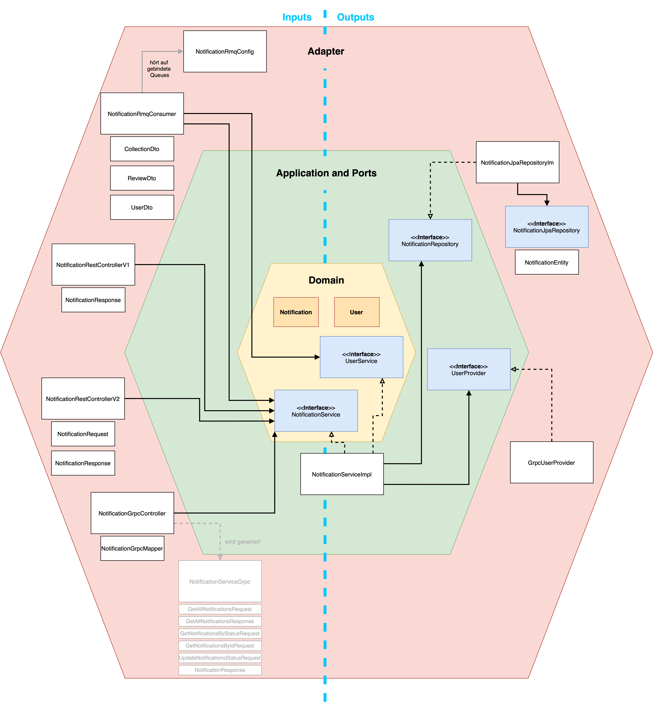

# Notification Service

[](https://sonarcloud.io/summary/new_code?id=THI-CND_notification_service)

## Übersicht

Der **Notification Service** verwaltet Benachrichtigungen für Benutzer. Er unterstützt sowohl REST- als auch gRPC-Schnittstellen und integriert RabbitMQ als Message Broker zum Empfangen von Events. Eine PostgreSQL-Datenbank dient als Datenspeicher.

## Architektur
Die Architektur des Notification Service folgt den Prinzipien der Hexagonalen Architektur, auch bekannt als Ports und Adapters. Dieses Designmuster stellt eine klare Trennung der Verantwortlichkeiten sicher, wodurch das System wartbarer und anpassungsfähiger an Änderungen wird. Abhängigkeiten verlaufen dabei von außen nach innen.



## Installation und Start

### Voraussetzungen

Um den Notification Service auszuführen, sind folgende Tools erforderlich:

- **Java 23 Temurin JDK**
- **Maven 3+**
- **Docker**
- **Docker Compose**

### Manuelle Installation und Start

1. **Repository klonen**  
   Klone das Repository in das gewünschte Verzeichnis und navigiere in den Ordner:

   ```bash
   git clone https://github.com/THI-CND/notification_service.git

   cd notification_service
   ```

2. **Projekt bauen**

   ```bash
   mvn clean install
   ```

3. **Projekt starten**

   ```bash
   java -jar target/notification-service-<version>.jar
   ```

### Starten mit Docker

1. **Repository klonen**  
   Klone das Repository in das gewünschte Verzeichnis und navigiere in den Ordner:

   ```bash
   git clone https://github.com/THI-CND/notification_service.git

   cd notification_service
   ```

2. **Docker Compose starten**  
   Stelle sicher, dass Docker installiert und betriebsbereit ist. Navigiere in den Projektordner und starte alle notwendigen Dienste mit dem Befehl:

   ```bash
   docker-compose up
   ```

   Dies startet:

   - **PostgreSQL**: Die Datenbank für den Notification Service.
   - **RabbitMQ**: Für die Nachrichtenvermittlung und Ereignisverarbeitung.
   - **Notification Service**: Der Hauptdienst.

3. **Überprüfen des Service**  
   Nach dem Start sind die APIs verfügbar unter:
   - **REST API**: Port 8080
   - **gRPC**: Port 9090

### Umgebungsvariablen

Die folgenden Umgebungsvariablen werden zur Konfiguration des Dienstes verwendet:

- `SPRING_PROFILES_ACTIVE`: Das Applikations-Profil.
- `DB_USER`: Der Datenbankbenutzer.
- `DB_PASSWORD`: Das Datenbankpasswort.
- `DB_URL`: Die URL inklusive Port der Datenbank.
- `RABBITMQ_USER`: Der RabbitMQ-Benutzer.
- `RABBITMQ_PASSWORD`: Das RabbitMQ-Passwort.
- `RABBITMQ_HOST`: Der RabbitMQ-Host.
- `RABBITMQ_PORT`: Der RabbitMQ-Port.
- `RABBITMQ_EXCHANGE`: Der RabbitMQ-Exchange.
- `RABBITMQ_ROUTING_KEYS_COLLECTION`: Routing-Keys für den Collection-Service.
- `RABBITMQ_ROUTING_KEYS_REVIEW`: Routing-Key für den Review-Service.
- `RABBITMQ_ROUTING_KEYS_USER`: Routing-Key für den User-Service.
- `RABBITMQ_QUEUE_COLLECTION`: Queue für den Collection-Service.
- `RABBITMQ_QUEUE_REVIEW`: Queue für den Review-Service.
- `RABBITMQ_QUEUE_USER`: Queue für den User-Service.
- `GRPC_USER_SERVICE_HOST`: gRPC Host des User-Service.
- `GRPC_USER_SERVICE_PORT`: gRPC Port des User-Service.

### Profile

#### Development

Standardmäßig wird das Profil `development` verwendet.\
Das Profil beinhaltet das Leeren der Datenbank.

#### Production

Das Profil `production` kann mit dieser Umgebungsvariable aktiviert werden:

```bash
SPRING_PROFILES_ACTIVE=production
```

#### Test

Zum Ausführen der Tests ist das Profil `test` aktiviert.\
Es startet eine lokale H2-Datenbank die zum Standalone Test verwendet werden kann.

## Schnittstellen

### REST API

#### V1

#### GET /api/v1/notifications

Ruft alle Benachrichtigungen für einen bestimmten Benutzer ab.

**Request:**

- Methode: GET
- URL: `/api/v1/notifications`
- Parameter:
  - `username` (String): Der Benutzername des Benutzers, dessen Benachrichtigungen abgerufen werden sollen.

**Response:**

- Status: 200 OK
- Body: Eine Liste von Benachrichtigungen.

**Beispiel:**
GET "http://localhost:8080/api/v1/notifications?username=Bernd"

#### GET /api/v1/notifications/status/{status}

Ruft alle Benachrichtigungen mit einem bestimmten Status für einen bestimmten Benutzer ab.

**Request:**

- Methode: GET
- URL: `/api/v1/notifications/status/{status}`
- Parameter:
  - `username` (String): Der Benutzername des Benutzers, dessen Benachrichtigungen abgerufen werden sollen.
  - `status` (Notification.NotificationStatus): Der Status der Benachrichtigungen (READ, UNREAD, DELETED).

**Response:**

- Status: 200 OK
- Body: Eine Liste von Benachrichtigungen.

**Beispiel:**
GET "http://localhost:8080/api/v1/notifications/status/UNREAD?username=Bernd"

#### GET /api/v1/notifications/{id}

Ruft eine bestimmte Benachrichtigung ab.

**Request:**

- Methode: GET
- URL: `/api/v1/notifications/{id}`
- Parameter:
  - `username` (String): Der Benutzername des Benutzers, der die Benachrichtigung abruft.
  - `id` (Long): Die ID der Benachrichtigung.

**Response:**

- Status: 200 OK
- Body: Die angeforderte Benachrichtigung.

**Beispiel:**
GET "http://localhost:8080/api/v1/notifications/1?username=Bernd"

#### V2

#### PUT /api/v2/notifications/{id}

Aktualisiert den Status einer Benachrichtigung.

**Request:**

- Methode: PUT
- URL: `/api/v2/notifications/{id}`
- Parameter:
  - `username` (String): Der Benutzername des Benutzers, der die Benachrichtigung aktualisiert.
  - `id` (Long): Die ID der Benachrichtigung.
  - **Body:**
    ```json
    {
      "status": "READ | UNREAD | DELETED"
    }
    ```

**Response:**

- Status: 200 OK
- Body: Die aktualisierte Benachrichtigung.

**Beispiel:**
PUT "http://localhost:8080/api/v2/notifications/1?username=Bernd"

```json
{
  "status": "READ"
}
```

### gRPC API

```java
syntax = "proto3";

package com.notification_service.stubs;

option java_multiple_files = true;
option java_package = "com.notification_service.stubs";
option java_outer_classname = "NotificationServiceProto";

service NotificationService {
rpc GetAllNotifications (GetAllNotificationsRequest) returns (GetAllNotificationsResponse);
rpc GetNotificationById (GetNotificationByIdRequest) returns (NotificationResponse);
rpc UpdateNotificationStatus (UpdateNotificationStatusRequest) returns (NotificationResponse);
rpc GetNotificationsByStatus (GetNotificationsByStatusRequest) returns (GetAllNotificationsResponse);
}

enum NotificationStatus {
READ = 0;
UNREAD = 1;
DELETED = 2;
}
message GetAllNotificationsRequest {
string username = 1;
}

message GetAllNotificationsResponse {
repeated NotificationResponse notifications = 1;
}

message GetNotificationsByStatusRequest {
string username = 1;
NotificationStatus status = 2;
}

message GetNotificationByIdRequest {
string username = 1;
int64 id = 2;
}

message UpdateNotificationStatusRequest {
string username = 1;
int64 id = 2;
NotificationStatus status = 3;
}

message NotificationResponse {
int64 id = 1;
string username = 2;
string title = 3;
string message = 4;
NotificationStatus status = 5;
}
```

## RabbitMQ Consumer

### Routing-Keys: `collection.created`, `collection.updated`, `collection.deleted`, `review.created`, `users.count`

Empfängt Nachrichten über erstellte, aktualisierte und gelöschte Sammlungen, erstellte Reviews und Benutzerzahlen und speichert die Benachrichtigung zusammen mit dem Benutzer in der Datenbank.

**Listener:**

Nachrichten, die mit einem akzeptierten Routing-Key über den passenden Exchange gesendet werden, werden über verschiedene Queues empfangen und individuell über DTOs verarbeitet, den Nutzern zugeordnet und als Benachrichtigungen persistiert.

**Parameter:**

- individuelle messageDtos, welche die JSON-Bodys der empfangenen Events verarbeiten
- Routing-Key

**Beispiel:**

```java
@RabbitListener(queues = "collection.queue")
public void handleCollectionMessages(@Payload CollectionDto messageDto, @Header(AmqpHeaders.RECEIVED_ROUTING_KEY) String routingKey)
{
  // Verarbeitung der empfangenen Nachricht
}
```

## Datenmodell Notifications

Zur Speicherung der Benachrichtigungen wird folgendes Modell verwendet:

| Spalte   | Typ           | Beschreibung                                        |
|----------|---------------|-----------------------------------------------------|
| id       | Long          | Auto-incrementing ID                                |
| username | String        | Name des Benutzers                                  |
| title    | String        | Titel der Benachrichtigung                          |
| message  | String        | Inhalt der Benachrichtigung                         |
| status   | Enum (String) | Status der Benachrichtigung (READ, UNREAD, DELETED) |

